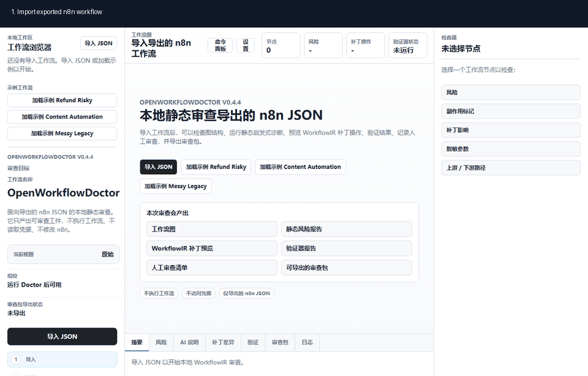
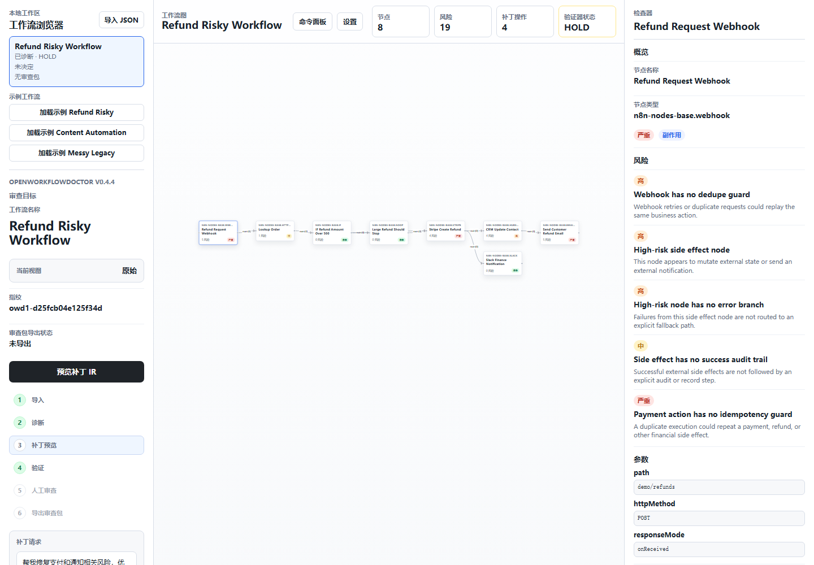

# OpenWorkflowDoctor

Local-first Workflow Review IDE for existing workflow artifacts.

OpenWorkflowDoctor reviews workflows. It does not run them.

Current release line: `v0.9.0` Review Packet Export Polish.

It is not a workflow builder, workflow runtime, automatic n8n fixer, or production n8n mutator.

It turns exported n8n JSON, optional read-only n8n imports, Dify DSL YAML, Coze workflow definition JSON, or Custom Graph JSON into a secret-safe WorkflowIR, static risk report, structured patch preview, verifier result, human review checklist, and exportable JSON, Markdown, and HTML review artifacts.

AI can explain and propose structured `PatchOperation` candidates, but deterministic validation, verifier gates, and human review remain required.



## What It Does

- Reviews exported n8n workflow JSON locally.
- Optionally imports workflows from n8n through read-only workflow API calls.
- Imports Dify DSL YAML as a local diagnosis-only review copy.
- Imports Coze workflow definition JSON as a local diagnosis-only review copy.
- Imports safe declarative Custom Graph JSON as a local diagnosis-only review copy.
- Shows graph structure, static risks, patch previews, verifier gates, and readable review reports.
- Keeps AI suggestions reviewable and bounded by structured validation.
- Never executes workflows, reads credentials, writes back to n8n, Dify, or Coze, activates/deactivates workflows, or exports platform-importable patched workflows.

## Screenshot



## Quick Try With Docker Compose

Docker Compose is the recommended public try-out path:

```bash
docker compose up
```

Open `http://localhost:3000`.

This starts OpenWorkflowDoctor only. It does not bundle n8n, does not require an AI provider key, and does not require an n8n connection. First-run Demo mode works with bundled sample workflows.

## Developer Setup With Node

Use Node setup for contribution work:

```bash
npm install
npm run dev -w apps/web
```

Open the URL printed by Next.js.

## Demo

Recommended demo flow:

1. Use first-run Demo mode, load a bundled refund workflow sample, or import `samples/n8n/refund-workflow.json`.
2. Run Doctor with the default reliability review request if the sample was not already diagnosed by onboarding.
3. Inspect the workflow graph, static risks, deterministic patch preview, verifier gates, and human review checklist.
4. Open Settings and review provider presets, including Verified, Preset, Experimental, and Custom tiers.
5. Inspect the AI Patch Proposal boundary: AI can propose structured operations only, and unavailable providers fall back safely.
6. Apply the reviewed patch preview locally.
7. Export the JSON Review Packet, Markdown Review Report, or static HTML Review Report for human approval.

The exported packet and reports are OpenWorkflowDoctor review artifacts. They are not platform-importable workflow patches and they do not execute any side effects.

For local deployment details, see [Local Deployment](docs/local-deployment.md). For onboarding details, see [Onboarding](docs/onboarding.md). For troubleshooting, see [Troubleshooting](docs/troubleshooting.md). For a tighter walkthrough, see [Demo Guide](docs/demo-guide.md).

## Features

- Import exported n8n workflow JSON in the browser.
- Import selected workflows from n8n as local read-only review copies.
- Import Dify DSL `.yml` / `.yaml` files as local diagnosis-only review copies.
- Import Coze workflow definition `.json` files as local diagnosis-only review copies.
- Import Custom Graph `.json` files through the built-in declarative adapter.
- Parse workflow JSON into secret-safe `WorkflowIR`.
- Store multiple workflow reviews in a local IndexedDB workspace.
- Switch active workflows from Workflow Explorer without rerunning Doctor.
- Render a React Flow graph from deterministic workflow analysis.
- Show workflow summary, node risks, static diagnostics, and acceptance recommendation.
- Generate deterministic structured `PatchProposal` objects for supported reliability fixes.
- Apply structured `PatchOperation` objects only to `WorkflowIR` preview state.
- Keep original workflow, patched preview, verifier output, and human review decision separate.
- Export a `DoctorReviewPacket` JSON file plus Markdown and static HTML review reports with before/after risk counts, readable patch diff, verifier gates, checklist state, review target fingerprint, source metadata, and human decision.
- Support advisory AI explanations with local BYOK provider settings and deterministic fallback.
- Support AI-assisted patch proposals as validated structured `PatchOperation` candidates, with deterministic validation, patch preview, verifier gates, and human review still required.
- Store n8n connection metadata locally while keeping n8n API keys session-only by default.
- Provide first-run onboarding, demo mode, in-product troubleshooting, and local reset controls.
- Support `zh-CN` and `en-US` UI copy.

Supported static diagnostics currently include webhook dedupe, HTTP timeout, payment idempotency, missing error branches, incomplete control-flow routes, and missing success audit trails.

## Trust Boundaries

OpenWorkflowDoctor is local-first and review-first.

- Imported workflow data stays in the browser workspace.
- Settings, language, theme, and local AI provider settings stay in browser local storage.
- AI API keys are masked in the UI and are not included in `WorkflowIR`, `DoctorReviewPacket`, or exported artifacts.
- n8n API keys are stored session-only and are not included in `WorkflowIR`, `DoctorReviewPacket`, Review Packet Artifacts, or Workflow Documents.
- Sensitive parameter previews such as API keys, authorization headers, passwords, tokens, and secrets are redacted before they enter WorkflowIR, UI, or review exports.
- Review reports are generated from sanitized Review Packet data and exclude raw source artifacts, raw prompts, raw code, raw SQL, credentials, provider keys, signed URLs, native platform patch output, and secret values.
- n8n read-only import uses only workflow list/get endpoints with `excludePinnedData=true`.
- Dify DSL import parses local YAML only and never calls Dify APIs, fetches resources, executes workflows, publishes, or writes back.
- Coze definition import parses local JSON only and never calls Coze APIs, fetches resources, executes workflows, publishes, or writes back.
- Custom Graph JSON import is declarative only and never executes JavaScript, mapping rules, remote schemas, or plugins.
- Static diagnostics and deterministic patch generation work without an LLM.
- AI Explainer remains advisory-only.
- AI Patch Proposal can propose validated structured changes, but it cannot apply patches, mutate raw n8n JSON, change verifier status, or change human review.
- Patch generation and verification are separate steps.
- A Builder Agent may propose changes in future versions, but only a Verifier can mark them `pass`, `hold`, or `fail`.
- Human review is recorded separately from verifier output.

Out of scope for the current MVP:

- workflow execution
- credential lookup or credential storage
- production n8n mutation
- raw n8n JSON mutation by an LLM
- automatic write-back to n8n
- platform-importable patched workflow export

## Version Roadmap

| Version | Status | Scope |
| --- | --- | --- |
| v0.1.0 | Frozen | Deterministic Workflow Doctor and Review Packet |
| v0.2.0 | Frozen | Advisory AI Explainer, Settings, i18n, and BYOK AI Provider |
| v0.3.0 | Frozen | Local Workspace and Multiple Workflows |
| v0.3.1 | Frozen | Workbench Refactor |
| v0.3.2 | Frozen | Public GitHub readiness cleanup |
| v0.4.0 | Frozen | Constrained AI Patch Proposal. AI can only output validated structured `PatchOperation` data. |
| v0.4.2 | Frozen | Real-model happy path and provider compatibility smoke results |
| v0.4.3 | Frozen | Provider Presets and Compatibility Registry |
| v0.4.4 | Frozen | Public demo polish, README demo media, issue templates, and feedback roadmap |
| v0.5.0 | Frozen | Read-only n8n Import. Import only, no execution and no write-back. |
| v0.5.1 | Frozen | Real n8n import polish, CORS/proxy hardening, and manual smoke checklist. |
| v0.5.2 | Frozen | Onboarding, Docker Compose local deployment, demo mode, troubleshooting, and reset polish. |
| v0.6.0 | Frozen | Dify DSL YAML Import. Import only, no Dify API, no execution, no publish, and no write-back. |
| v0.6.1 | Frozen | Dify read-only import feasibility only. No shipped Dify API connection or user-facing import surface. |
| v0.7.0 | Frozen | Coze Workflow Definition JSON Import. Import only, no Coze API, no execution, no resource fetch, no publish, and no write-back. |
| v0.8.0 | Frozen | Adapter SDK / Source Adapter Framework. Static built-in adapters, unified import pipeline, shared guardrails, conformance kit, and Custom Graph JSON. |
| v0.9.0 | Frozen | Review Packet Export Polish. Canonical JSON packet preserved, Markdown and static HTML review reports added, readable report preview, stale warnings, and secret-safe export tests. |

The current product definition through v0.9.0:

OpenWorkflowDoctor is a local-first Workflow Review IDE. It supports importing multiple workflows from n8n JSON, optional read-only n8n workflow reads, Dify DSL YAML, Coze definition JSON, or Custom Graph JSON, running static diagnostics, previewing WorkflowIR patches, reviewing verifier output, recording human review, exporting JSON/Markdown/HTML review artifacts, generating advisory AI explanations, and requesting constrained AI PatchOperation proposals through configurable BYOK providers. AI never participates in final acceptance.

## Architecture

The product follows this flow:

```text
n8n JSON / n8n read-only / Dify DSL / Coze definition JSON / Custom Graph JSON
  -> secret-safe WorkflowIR
  -> graph view model + summary + diagnostics
  -> structured patch proposal + readable diff
  -> human-reviewed patched preview
  -> verifier report
  -> JSON/Markdown/HTML review export + acceptance checklist
  -> human accept / hold / reject
```

For report export details, see [Review Report Export](docs/review-report-export.md). For adapter framework details, see [Adapter SDK](docs/adapter-sdk.md), [Custom Graph JSON Import](docs/custom-graph-json-import.md), and [Source Adapter Conformance](docs/source-adapter-conformance.md). For read-only n8n import details, see [v0.5 Read-only n8n Import](docs/n8n-readonly-import.md). For Dify YAML import details, see [v0.6 Dify DSL Import](docs/dify-dsl-import.md). For Coze JSON import details, see [v0.7 Coze Workflow Definition Import](docs/coze-definition-import.md). For deferred Dify read-only import analysis, see [v0.6.1 Dify Read-only Import Feasibility](docs/dify-readonly-import-feasibility.md). For real-instance validation, see [Real n8n Import Smoke Test](docs/real-n8n-import-smoke-test.md).

Core rules:

- Always parse imported workflow JSON into WorkflowIR first.
- Never let an LLM directly mutate raw n8n JSON.
- Represent all patch proposals as structured PatchOperation objects.
- Validate LLM output with Zod before it can enter the patch pipeline.
- Unknown node types must not crash the system.
- Rule-based diagnostics must work without LLM.
- External credentials must never be read or stored.

## Packages

- `packages/workflow-ir`: deterministic WorkflowIR, diagnostics, patch proposal, verification, and review packet logic.
- `packages/workflow-ai`: advisory AI explanation, constrained AI patch proposal, provider registry, and provider helper contracts.
- `apps/web`: local browser workbench.
- `samples/n8n`: demo exported workflow JSON.
- `samples/dify`: demo Dify DSL YAML.
- `samples/coze`: demo Coze workflow definition JSON.
- `samples/custom-graph`: demo Custom Graph JSON.

## Local Development

Install dependencies:

```bash
npm install
```

Run the workbench:

```bash
npx next dev apps/web -p 3001
```

Run checks:

```bash
npm test
npm run lint
npm run typecheck
npm run build
npm run test:e2e
```

Run dependency audit:

```bash
npm audit
```

## Public Release Docs

- [CHANGELOG.md](CHANGELOG.md)
- [SECURITY.md](SECURITY.md)
- [ROADMAP.md](ROADMAP.md)
- [GitHub release notes](docs/github-release-notes.md)
- [Review Report Export](docs/review-report-export.md)
- [Demo Guide](docs/demo-guide.md)
- [Feedback Guide](docs/feedback-guide.md)
- [Provider presets and compatibility](docs/provider-presets-compatibility.md)
- [Read-only n8n import](docs/n8n-readonly-import.md)
- [Dify DSL import](docs/dify-dsl-import.md)
- [Coze workflow definition import](docs/coze-definition-import.md)
- [Dify read-only import feasibility](docs/dify-readonly-import-feasibility.md)
- [Real n8n Import Smoke Test](docs/real-n8n-import-smoke-test.md)
- [Manual AI Patch Proposal smoke test](docs/manual-ai-patch-smoke-test.md)
- [Real-model smoke results v0.4.2](docs/real-model-smoke-results-v0.4.2.md)
- [Public GitHub audit notes v0.3.1](docs/public-github-audit-v0.3.1.md)
